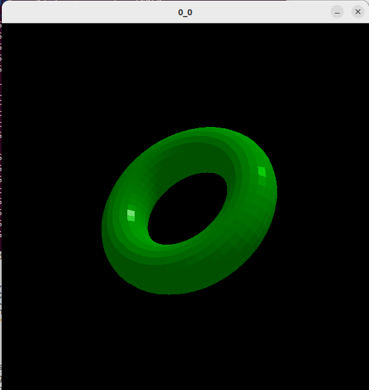

# SDL_3d

A port of a class project implementing flat shading via painter's algorithm, using SDL instead of the professor's X11 wrapper.

Reads in XYZ files with connectivity information as command-line arguments:

```
[Number of vertices]
[X coordinate of first vertex] [Y coordinate of first vertex] [Z coordinate of first vertex]
...
[X coordinate of last vertex] [Y coordinate of last vertex] [Z coordinate of last vertex]
[Number of polygons]
[Number of points in first polygon] [Index of first point in polygon] ... [Index of last point in polygon]
...
[Number of points in last polygon] [Index of first point in polygon] ... [Index of last point in polygon]
```

In program, use the following keystrokes to transform your image:

Translations: Arrow keys, +, -

Rotations (In place, about center of mass): x, y, z

Sample image of program:


